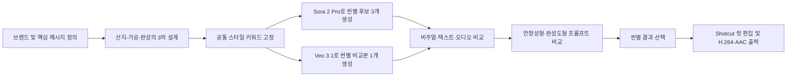

# 하동미차 AI 브랜드 광고

> 안개가 머문 자리에서, 하루의 온도가 시작된다.

하동의 차밭에서 시작해 찻잎의 가공 과정을 지나 한 잔의 차로 완성되는 흐름을 담은 생성형 AI 브랜드 광고 프로젝트입니다. 이미지 레퍼런스나 별도의 음성 합성 없이, **Sora 2 Pro의 텍스트 기반 영상과 네이티브 오디오**로 최종본을 제작했습니다. 같은 스토리보드를 **Veo 3.1**로도 생성해 도구별 결과를 비교했습니다.

## 프로젝트 개요

| 항목 | 내용 |
| --- | --- |
| 브랜드 | 하동미차 / HADONG MIST TEA (가상 브랜드) |
| 제품 | 하동 지역의 자연과 가공 문화를 모티프로 한 프리미엄 녹차 |
| 캠페인 목적 | 브랜드 인지도 형성 |
| 핵심 메시지 | 안개가 머문 자리에서, 하루의 온도가 시작된다. |
| 타겟 | 차분한 웰니스와 지역 기반 프리미엄 제품에 관심 있는 20~40대 |
| 톤앤매너 | 안개, 이른 아침, 짙은 녹색, 따뜻한 금빛, 나무, 도자기, 절제된 고급스러움 |
| USP | 하동의 자연환경과 찻잎의 변화 과정을 하나의 감각적인 서사로 전달 |
| 생성 도구 | Sora 2 Pro(최종본), Veo 3.1(비교본) |
| 생성 방식 | 텍스트 투 비디오, 네이티브 오디오 동시 생성 |
| 영상 편집 도구 | Shotcut |
| 최종 출력 | 16:9 / 1280×720 / 30fps / H.264·AAC |

## 영상

[최종 영상 보기](./videos/최종본.mp4)

| 항목 | 실제 파일 정보 |
| --- | --- |
| 파일명 | `videos/최종본.mp4` |
| 길이 | 10초 |
| 해상도 / 화면비 | 1280×720 / 16:9 |
| 프레임레이트 | 30fps |
| 비디오 / 오디오 코덱 | H.264 (`avc1`) / AAC |
| 파일 크기 | 약 2.6MB |

각 씬은 Sora 2 Pro로 후보 3개, Veo 3.1로 비교본 1개를 생성했습니다. 총 12개 결과를 비교한 뒤 Sora 장면을 선택하고, Shotcut에서 연결해 메시지 전달에 불필요한 앞뒤 구간을 제거했습니다.

## 기획 의도

텍스트만으로 생성한 여러 영상에서 동일한 인물, 제품 패키지 또는 로고를 완벽하게 유지하기는 어렵습니다. 이 프로젝트는 그 한계를 억지로 숨기기보다, **형태가 변하는 것이 자연스러운 차의 생산 과정 자체를 서사로 선택**했습니다.

차밭의 생잎, 가공 중인 찻잎, 완성된 차는 서로 형태가 달라도 관객이 같은 제품의 여정으로 받아들일 수 있습니다. 따라서 일관성의 기준을 특정 사물의 정확한 복제 대신 다음 요소에 두었습니다.

- 서사: 산지 → 가공 → 완성된 한 잔
- 색상: 짙은 녹색, 흰 안개, 따뜻한 금빛
- 소재: 찻잎, 나무 채반, 증기, 흰 도자기
- 촬영 문법: 느린 카메라 이동, 매크로 클로즈업, 얕은 심도
- 정서: 차분함, 자연성, 장인성, 지역 기반의 프리미엄 이미지
- 오디오: 자연의 소리에서 가공음과 차 따르는 소리로 이어지는 점진적 변화

이미지 시드와 스타일 레퍼런스는 사용하지 않았습니다. 대신 세 프롬프트에 동일한 색감·조명·촬영·정서 키워드를 반복해 텍스트 수준의 스타일 앵커로 사용했습니다.

## 제작 파이프라인



영상 생성 전에 브랜드 메시지와 장면의 기능을 먼저 결정했습니다. 별도의 이미지 키프레임은 만들지 않았으며, 각 씬이 앞 장면의 물체를 그대로 복제하는 대신 다음 생산 단계로 자연스럽게 이어지도록 설계했습니다. Sora 결과는 각 단계마다 세 번 생성하고, 같은 요구를 Veo 3.1로 한 번 더 생성해 구도, 움직임, 글자 표현과 오디오를 비교했습니다. 최종본의 오디오는 별도 TTS나 음악 생성 도구를 결합하지 않고 Sora 2 Pro에서 화면과 함께 생성해 장면과 소리의 타이밍 불일치를 줄였습니다.

## 사용 도구와 선택 이유

| 영역 | 실제 사용 도구 | 사용 목적과 선택 이유 |
| --- | --- | --- |
| 이미지 | 별도 이미지 생성 도구 미사용 | 사용한 영상 도구가 이미지 입력을 지원하지 않아 이미지 시드 방식 대신 텍스트 스타일 앵커를 사용 |
| 비디오 | Sora 2 Pro | 산지, 가공, 제품 히어로샷과 사람 음성을 텍스트만으로 생성하고 최종본에 사용 |
| 비교 비디오 | Veo 3.1 | 동일 스토리보드를 다른 영상 모델로 생성해 텍스트·음성·영상 표현 차이 비교 |
| 오디오 | Sora 2 Pro 네이티브 오디오 | 영상과 동시에 환경음, 가공음, 차 따르는 소리 및 음악 분위기를 생성해 동기화 유지 |
| 음성 합성 | 별도 TTS 미사용 | Shotcut을 컷 자르기와 연결 중심으로 사용한 상황에서 생성 영상의 환경음 위에 별도 TTS 음성을 자연스럽게 배치하고 음량·타이밍을 조정하기 어려워 네이티브 음성을 유지 |
| 통합 편집 | Shotcut | 생성된 씬 연결, 최종 길이 조정 및 출력 파일 인코딩 |

도구 접근 제한에 대비한 대안은 이미지 생성 `GPT Image 2`, 비디오 생성 `Veo 3.1`, 음성 생성 `TTS-1 HD`로 설정했습니다. 이 가운데 Veo 3.1은 실제 비교본 제작에 사용했으며, GPT Image 2와 TTS-1 HD는 사용하지 않았습니다.

### 별도 TTS를 사용하지 않은 이유

이 프로젝트에서 Shotcut은 생성된 장면을 자르고 이어 붙이는 기본적인 통합 편집 용도로 사용했습니다. Sora 영상에는 이미 장면에 맞는 환경음과 사람 음성이 함께 생성되어 있었습니다. 여기에 TTS-1 HD 음성을 별도로 추가하려면 기존 환경음과 음성을 분리하거나, 구간별 음량·타이밍·페이드와 믹싱을 세밀하게 조정해야 합니다. 제한된 편집 범위에서 이를 자연스럽게 통합하기 어렵다고 판단해 별도 TTS를 사용하지 않고 Sora의 네이티브 오디오를 유지했습니다.

## 스토리보드

### Scene 01 — 산지, 안개의 시작

| 필드 | 내용 |
| --- | --- |
| 씬 번호 / 길이 | Scene 01 / 4초 |
| 목표 메시지 | 하동의 안개와 자연환경이 제품의 시작임을 각인한다. |
| 화면 구성 | 안개 낀 하동 차밭의 와이드숏에서 이슬 맺힌 어린 찻잎의 매크로숏으로 이동. 흰 안개, 짙은 녹색 차밭, 금빛 일출이 중심이며 화면 카피가 나타난다. |
| 내레이션 또는 화면 카피 | `안개가 키운 잎` |
| 사용 도구 / 목적 | Sora 2 Pro: 텍스트 기반 비디오와 산바람·새소리·잔잔한 음악을 함께 생성. Veo 3.1: 동일 장면 비교 생성 |
| 출력 결과 요약 | 지역의 청정함과 차분한 브랜드 분위기를 한 번에 보여주는 도입부를 확보했다. |
| 결과 파일명 | Sora: [`1-1.mp4`](./videos/1-1.mp4), [`1-2.mp4`](./videos/1-2.mp4), [`1-3.mp4`](./videos/1-3.mp4) / Veo: [`1-4.mp4`](./videos/1-4.mp4) |

<details>
<summary>입력 프롬프트 원문</summary>

```text
Create a 4-second premium cinematic commercial scene for a Korean green tea brand called “하동미차 / HADONG MIST TEA”.

The scene opens at dawn in the Hadong tea fields of Korea. Low white mist moves slowly between deep green tea bushes arranged along soft mountain slopes. The morning sun rises behind the hills, creating warm golden light through the fog. Dew drops sparkle on fresh young tea leaves. The camera begins with a wide aerial view of the misty tea fields, then slowly glides downward into an intimate macro close-up of one fresh tea leaf covered in dew.

Visual mood: calm, premium, natural, poetic, refined Korean local luxury.
Color palette: deep green tea leaves, soft white mist, warm golden sunrise.
Camera style: cinematic slow motion, smooth floating movement, shallow depth of field at the end.
Lighting: natural sunrise light, soft and elegant.

On-screen text appears gently in Korean calligraphy style:
“안개가 키운 잎”

Audio: quiet mountain morning ambience, soft wind, distant birds, gentle cinematic music beginning softly.

No modern buildings, no city, no tourists. Make it feel like the origin of a premium tea.
Aspect ratio 16:9, 4 seconds.
```

</details>

### Scene 02 — 가공, 손끝의 시간

| 필드 | 내용 |
| --- | --- |
| 씬 번호 / 길이 | Scene 02 / 4초 |
| 목표 메시지 | 자연에서 얻은 생잎이 사람의 시간과 기술을 거쳐 깊은 차로 변화함을 보여준다. |
| 화면 구성 | 생잎을 덖고 비비고 말리는 과정을 매크로로 연결한다. 손, 나무 작업대, 대나무 채반, 증기와 찻잎의 질감 변화가 중심이다. |
| 내레이션 또는 화면 카피 | `손끝에서 깊어지고` |
| 사용 도구 / 목적 | Sora 2 Pro: 가공 과정의 움직임과 잎 스치는 소리·덖음 소리를 동시에 생성. Veo 3.1: 동일 장면 비교 생성 |
| 출력 결과 요약 | 찻잎의 형태와 색이 달라지는 모습을 장인성과 시간의 표현으로 활용했다. |
| 결과 파일명 | Sora: [`2-1.mp4`](./videos/2-1.mp4), [`2-2.mp4`](./videos/2-2.mp4), [`2-3.mp4`](./videos/2-3.mp4) / Veo: [`2-4.mp4`](./videos/2-4.mp4) |

<details>
<summary>입력 프롬프트 원문</summary>

```text
Create a 4-second premium cinematic commercial scene for “하동미차 / HADONG MIST TEA”, continuing from the misty Hadong tea field origin.

Fresh green tea leaves are being carefully processed in a traditional Korean tea workshop. Show close-up shots of skilled hands gently roasting, rolling, and drying the tea leaves on a warm wooden surface and bamboo tray. Steam rises softly from the leaves. The color of the leaves changes from fresh vivid green to deeper curled green tea leaves, showing time, craftsmanship, and transformation. The movement should feel rhythmic and elegant, not documentary, like a luxury product film.

Camera sequence: macro close-up of fresh leaves, slow motion steam rising, hands rolling leaves, final close-up of curled processed tea leaves.
Visual mood: warm, artisanal, quiet, refined, premium.
Color palette: green tea leaves, warm amber light, wood, steam.
Lighting: soft golden indoor light, natural and intimate.

On-screen text appears briefly:
“손끝에서 깊어지고”

Audio: soft roasting sound, gentle leaf rustle, subtle wooden tray sound, warm low cinematic music.

Make the scene feel like the transformation from nature into taste.
Aspect ratio 16:9, 4 seconds.
```

</details>

### Scene 03 — 완성, 한 잔의 브랜드

| 필드 | 내용 |
| --- | --- |
| 씬 번호 / 길이 | Scene 03 / 4초 |
| 목표 메시지 | 산지와 가공의 시간이 한 잔의 차와 브랜드 경험으로 완성됨을 전달한다. |
| 화면 구성 | 흰 도자기 찻잔에 연녹색 차가 따라지고 증기가 오른다. 제품 패키지, 브랜드명과 슬로건이 마지막 히어로숏에 함께 나타난다. |
| 내레이션 또는 화면 카피 | `안개가 머문 자리에서, 하루의 온도가 시작됩니다. 하동미차.` |
| 사용 도구 / 목적 | Sora 2 Pro: 제품 히어로숏, 브랜드 텍스트, 차 따르는 소리와 사람 음성을 함께 생성. Veo 3.1: 동일 장면 비교 생성 |
| 출력 결과 요약 | 일부 글자 왜곡이 있었지만 조명·패키지·카피가 결합되면서 가장 높은 광고적 완성도를 얻었다. |
| 결과 파일명 | Sora: [`3-1.mp4`](./videos/3-1.mp4), [`3-2.mp4`](./videos/3-2.mp4), [`3-3.mp4`](./videos/3-3.mp4) / Veo: [`3-4.mp4`](./videos/3-4.mp4) |

<details>
<summary>입력 프롬프트 원문</summary>

```text
Create a 4-second final hero shot for a premium Korean green tea commercial for “하동미차 / HADONG MIST TEA”.

A beautiful final product scene on a quiet morning tea table. A matte white ceramic teacup sits on a dark wooden tray beside an elegant minimal tea package labeled clearly with the brand name:
“하동미차”
“HADONG MIST TEA”

Pale green tea with a subtle golden tint is poured slowly into the cup from a refined ceramic teapot. Gentle steam rises in elegant swirling motion. Beside the cup are a few dried curled green tea leaves and a small linen cloth. The background is softly blurred with a misty window and warm morning sunlight, connecting back to the Hadong tea fields from the first scene.

Camera: cinematic macro hero shot, slow dolly-in toward the cup and package, ending on the brand name and steaming tea.
Visual mood: premium, calm, elegant, local Korean luxury.
Color palette: white ceramic, pale green tea, warm wood, soft golden light, misty background.

Final on-screen slogan appears clearly and beautifully:
“안개가 머문 자리에서, 하루의 온도가 시작된다.”

Audio: tea pouring sound, soft ceramic tone, calm final music swell.
Narration voice, calm and warm:
“안개가 머문 자리에서, 하루의 온도가 시작됩니다. 하동미차.”

Make this feel like the final shot of a refined national tea brand commercial.
Aspect ratio 16:9, 4 seconds.
```

</details>

## 프롬프트 수정 전후 비교

Scene 03은 **생성 안정성을 우선한 프롬프트**와 **광고 완성도를 우선한 프롬프트**를 비교했습니다.

### 수정 전: 생성 안정성 우선

```text
Premium Korean green tea commercial final brand shot.

A clean cream-colored paper card on a dark wooden tea tray, with a white ceramic teacup of pale green tea beside it. Gentle steam rises from the cup. A few dried green tea leaves are placed neatly around the card. Misty morning window background, soft golden natural light, calm luxury Korean tea mood.

The paper card must show only two lines of exact readable text:
“MIST TEA”
“HADONG”

Use large black uppercase sans-serif letters. The text is centered, sharp, correctly spelled, and fills most of the card. No other text, no random letters, no logo distortion, no subtitles.

Slow cinematic dolly-in, shallow depth of field, premium tea commercial, 16:9, 1280x720 or higher, 4 seconds.
```

수정 전에는 짧은 영문 브랜드명과 평평한 카드만 사용해 텍스트 오류를 줄이는 데 집중했습니다. 결과는 안정적이었지만, 장면의 정보와 감정이 단순해 일반적인 제품 소개 영상처럼 보였습니다.

### 수정 후: 광고 완성도 우선

수정 후에는 Scene 03의 최종 프롬프트처럼 실제 브랜드명, 한글 슬로건, 제품 패키지, 내레이션, 차 따르는 소리, 카메라 이동과 빛의 방향을 모두 포함했습니다.

| 비교 항목 | 수정 전 | 수정 후 |
| --- | --- | --- |
| 우선순위 | 글자 정확성, 장면 안정성 | 브랜드 경험, 광고적 완성도 |
| 브랜드 표현 | 짧은 영문 카드 | 한글·영문 브랜드와 제품 패키지 |
| 장면 밀도 | 찻잔과 카드 중심 | 찻잔, 패키지, 증기, 슬로건, 내레이션 |
| 결과 | 안정적이지만 다소 단순함 | 일부 글자 왜곡이 있으나 훨씬 풍부하고 고급스러움 |
| 최종 판단 | 비교군으로 보존 | 최종 방향으로 채택 |

이 비교를 통해 텍스트 정확도만 높이는 것이 반드시 좋은 광고로 이어지지는 않는다는 점을 확인했습니다. 최종본은 일부 글자 왜곡을 감수하더라도 브랜드의 분위기와 감정 전달이 더 뛰어난 수정 후 방향을 선택했습니다.

## 비디오 생성 도구 비교

동일한 세 장면을 Sora 2 Pro와 Veo 3.1로 생성해 결과를 비교했습니다. `1-4.mp4`, `2-4.mp4`, `3-4.mp4`가 Veo 3.1 비교본입니다.

| 비교 항목 | Sora 2 Pro | Veo 3.1 |
| --- | --- | --- |
| 화면 텍스트 | 일부 왜곡은 있었지만 프롬프트의 글씨가 장면에 표현됨 | 요청한 글씨가 제대로 나타나지 않음 |
| 사람 음성 | 장면에 맞는 사람 음성이 생성됨 | 오디오 트랙과 환경음은 있으나 사람 음성은 생성되지 않음 |
| 광고 메시지 전달 | 브랜드명·카피·음성을 함께 활용 가능 | 시각적 분위기는 만들 수 있으나 브랜드와 내레이션 전달이 약함 |
| 출력 특성 | 약 4.09초, 1280×720, 30fps | 4초, 1280×720, 24fps |
| 최종 선택 | 최종 광고 소스로 채택 | 도구 비교본으로 보존 |

Veo 3.1은 같은 프롬프트로 영상과 환경음을 생성했지만, 이 광고에서 중요한 화면 글씨와 사람 음성을 충분히 구현하지 못했습니다. 최종본에는 브랜드 메시지를 시각과 청각으로 함께 전달한 Sora 2 Pro 결과를 선택했습니다.

## 결과 및 회고

### 잘 작동한 점

- 특정 캐릭터나 동일 제품 외형에 의존하지 않아 씬 간 형태 변화가 자연스러웠습니다.
- `산지 → 가공 → 완성`이라는 순서가 짧은 영상에서도 제품의 가치와 지역성을 명확히 전달했습니다.
- 안개, 녹색, 금빛, 나무, 증기, 도자기 등의 반복이 이미지 시드 없이도 시각적 연속성을 만들었습니다.
- 영상과 오디오를 동시에 생성해 효과음의 타이밍과 장면 분위기가 자연스럽게 맞았습니다.
- Veo 3.1 비교본을 추가해 동일 스토리보드에서 도구에 따라 텍스트와 음성 구현이 달라지는 점을 직접 확인했습니다.
- 프롬프트에 더 많은 광고 요소를 허용했을 때 텍스트는 일부 불안정했지만 전체적인 미장센과 몰입감은 개선됐습니다.

### 한계

- 이미지 생성 AI는 별도로 사용하지 않았습니다. 오디오는 Sora 2 Pro의 네이티브 생성 기능을 사용했으며, Veo 3.1 비교본에서는 오디오 트랙이 있었지만 요청한 사람 음성이 생성되지 않았습니다.
- 이미지 시드나 스타일 레퍼런스를 사용할 수 없어 각 씬의 세부 사물과 구도는 완전히 동일하지 않습니다.
- 생성형 영상의 한글 및 제품 라벨 표현에는 일부 왜곡이 남았습니다.
- 약 4초 길이의 세 장면을 연결한 뒤 Shotcut에서 메시지 전달에 불필요한 앞뒤 구간을 제거해 최종본을 10초로 완성했습니다.
- Shotcut은 씬 연결, 최종 길이 조정과 인코딩에만 사용하며, 핵심 비주얼과 오디오는 Sora 2 Pro 생성 결과를 유지합니다.

### 도구별 역할에 대한 판단

- 이미지 생성 도구는 키비주얼과 구도 탐색에는 유리하지만, 이번 환경에서는 생성 이미지를 영상 입력으로 전달할 수 없어 직접적인 일관성 유지 수단이 되지 못했습니다.
- 비디오 생성 도구는 움직임, 촬영, 조명, 사운드를 한 번에 설계할 수 있지만, 장면 간 동일 객체와 정확한 글자 표현에는 한계가 있었습니다.
- 별도 TTS는 발음과 목소리 통제에는 유리하지만, 컷 자르기와 연결 중심의 편집 범위에서 기존 환경음 위에 음성을 얹고 음량·타이밍을 자연스럽게 맞추는 작업은 어려웠습니다. 따라서 이번 작업에는 화면과 함께 생성된 네이티브 오디오가 더 적합했습니다.

## 요구사항 대응 현황

| 요구사항 | 상태 | 비고 |
| --- | --- | --- |
| 브랜드·타겟·톤앤매너·USP 정의 | 충족 | 하동미차 브랜드 아이덴티티 정의 |
| 캠페인 목표와 핵심 메시지 정의 | 충족 | 브랜드 인지도 / 핵심 메시지 1문장 |
| 씬별 스토리보드 필드 작성 | 충족 | 3개 씬에 필수 필드 기록 |
| 프롬프트 수정 전후 비교 | 충족 | Scene 03 비교 및 선택 이유 기록 |
| AI 생성 시각 요소 | 충족 | Sora 2 Pro 텍스트 투 비디오 |
| AI 생성 청각 요소 | 충족 | Sora 2 Pro 네이티브 오디오 |
| 이미지 생성 AI 별도 사용 | 미충족 | 이미지 입력 미지원으로 별도 이미지 생성 생략 |
| 비디오 생성 AI 사용 | 충족 | Sora 2 Pro와 Veo 3.1 사용 |
| 동일 요구의 도구별 결과 비교 | 충족 | 세 장면을 두 모델로 생성해 글씨·사람 음성·출력 특성 비교 |
| 오디오 생성 AI 사용 | 충족 | Sora 2 Pro 네이티브 오디오로 효과음과 음악 분위기 생성 |
| 마지막 브랜드 인지 장치 | 충족 | Scene 03에 브랜드명, 패키지, 슬로건 포함 |
| 10초 이내 최종 영상 | 충족 | Shotcut에서 불필요한 구간을 제거해 10초로 완성 |
| 생성형 AI 소스 중심 제작 | 충족 | 외부 촬영·유료 스톡 미사용 |

## 파일 구조

```text
.
├── README.md
├── LEARNING_OUTCOMES.md
└── videos/
    ├── README.md
    ├── 1-1.mp4 ... 1-4.mp4
    ├── 2-1.mp4 ... 2-4.mp4
    ├── 3-1.mp4 ... 3-4.mp4
    └── 최종본.mp4
```

씬 번호 뒤의 `1`~`3`은 Sora 2 Pro 후보 번호이며, `4`는 Veo 3.1 비교본입니다. 모든 후보와 최종본은 `videos/` 폴더에 보관합니다.

학습 목표에 대한 설명과 프로젝트 근거는 [학습 결과 정리](./LEARNING_OUTCOMES.md)에 별도로 정리했습니다.

## 저작권 및 윤리

모든 영상과 오디오는 생성형 AI를 통해 제작하며 직접 촬영 영상과 유료 스톡 소스를 사용하지 않습니다. 실제 인물의 얼굴이나 음성을 모방하지 않았으며, 혐오·선정성·폭력 또는 딥페이크 요소를 포함하지 않습니다. `하동미차`는 과제용 가상 브랜드이며 특정 실제 농가나 상품을 대표하지 않습니다.
