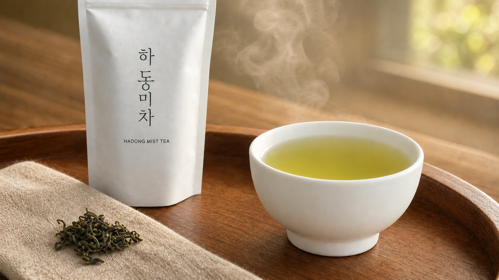

# Representative Image



`hadong-mist-tea-keyvisual-v2.png`는 최종 영상의 마지막 프레임을 참고해 OpenAI ImageGen으로 사후 생성한 GitHub 대표 이미지입니다. 영상 제작 이전의 키비주얼이나 영상 생성 입력 이미지로 사용하지 않았습니다. 처음 생성한 `hadong-mist-tea-keyvisual.png`에서 물줄기와 충돌 파문만 제거한 버전입니다.

## 이미지 정보

| 항목 | 내용 |
| --- | --- |
| 용도 | GitHub README 및 프로젝트 대표 이미지 |
| 현재 파일 | `hadong-mist-tea-keyvisual-v2.png` |
| 크기 | 1672×941 |
| 형식 | PNG |
| 생성 방식 | 최종 영상 프레임의 구도와 분위기를 참고한 이미지 생성 |
| 영상 제작 기여 | 없음. 영상 완성 후 별도로 제작 |

## 생성 프롬프트

```text
Create a sharp, high-resolution 16:9 premium Korean green tea advertisement based on the supplied final video frame. Preserve the left-package and right-cup composition. A clear stream of pale green tea pours into a pristine matte white Korean ceramic teacup, creating delicate ripples. Soft steam rises behind it. Place a tall minimal matte-white tea package on the left and dried curled green tea leaves on natural beige linen in the lower-left foreground. Use a warm walnut tea tray and softly blurred golden morning light.

Print the Korean brand name exactly “하동미차” vertically on the package, with exactly “HADONG MIST TEA” below it in small uppercase letters. Use crisp professional product photography, realistic ceramic, liquid, linen, tea leaves and wood textures. No people, no hands, no extra cups, no random letters, no watermark, no motion blur and no low-resolution artifacts.
```

## 수정 프롬프트

```text
Remove only the vertical stream of pouring liquid above the teacup and the impact ripple beneath it. Replace that area with the naturally blurred warm background and gentle steam. Make the pale green tea surface calm and smooth. Preserve the composition, crop, package, exact “하동미차 / HADONG MIST TEA” typography, cup, tea leaves, linen, wooden tray, lighting, colors and depth of field. Add no new objects and make no other changes.
```
