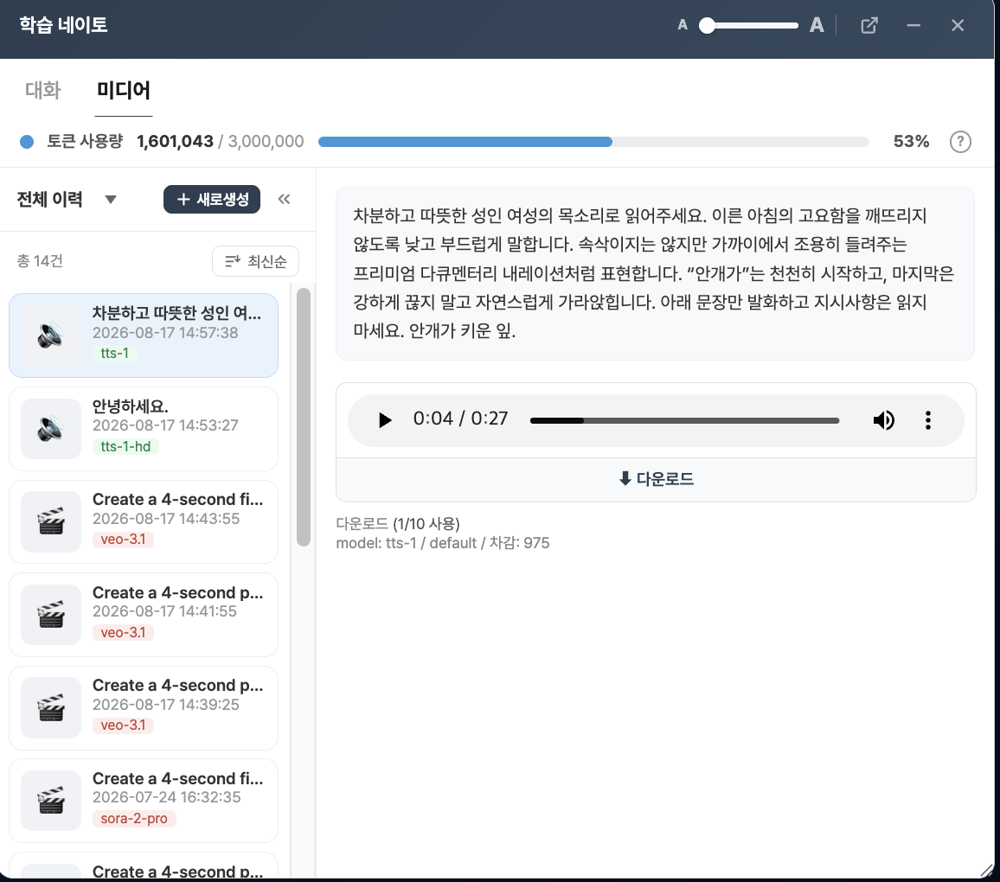

# 네이토 TTS 단일 프롬프트 실험

짧은 광고 내레이션에 목소리 연출 지시를 함께 적용할 수 있는지 확인하기 위해 진행한 TTS 실험입니다.

## 입력 프롬프트

```text
차분하고 따뜻한 성인 여성의 목소리로 읽어주세요. 이른 아침의 고요함을 깨뜨리지 않도록 낮고 부드럽게 말합니다. 속삭이지는 않지만 가까이에서 조용히 들려주는 프리미엄 다큐멘터리 내레이션처럼 표현합니다. “안개가”는 천천히 시작하고, 마지막은 강하게 끊지 말고 자연스럽게 가라앉힙니다. 아래 문장만 발화하고 지시사항은 읽지 마세요. 안개가 키운 잎.
```

의도한 실제 대사는 `안개가 키운 잎.` 한 문장이었습니다.

## 결과

현재 사용한 네이토 환경은 연출 지시와 발화 대사를 구분하는 별도 입력란이 없었습니다. 입력한 전체 프롬프트를 발화 텍스트로 처리해 목소리 지시와 “지시사항은 읽지 마세요”라는 문장까지 모두 낭독했습니다.

| 항목 | 결과 |
| --- | --- |
| 의도 | 한 문장의 차분한 여성 내레이션 생성 |
| 실제 결과 | 연출 지시를 포함한 입력문 전체 낭독 |
| 길이 | 27.408초 |
| 형식 | MP3, 모노, 24kHz, 128kbps |
| 프로젝트 활용 | 최종본에서 제외하고 실패 사례 및 의사결정 근거로 보존 |

## 증빙 파일

- [생성 오디오](./tts-instruction-readout.mp3)
- [생성 화면](./tts-instruction-readout.png)



## 판단

대사만 입력하면 불필요한 낭독은 피할 수 있지만, 이 환경에서는 원하는 성별·온도·속도·강세를 같은 프롬프트로 세밀하게 제어하기 어렵습니다. 별도 TTS를 최종 영상에 사용하려면 Sora의 기존 환경음과 음성을 정리한 뒤 새 음성의 타이밍, 음량과 페이드를 다시 맞춰야 합니다. 이번 프로젝트는 Shotcut의 컷 자르기와 연결을 중심으로 편집 범위를 제한했기 때문에, TTS 결과를 최종본에 사용하지 않고 Sora의 네이티브 오디오를 유지했습니다.
